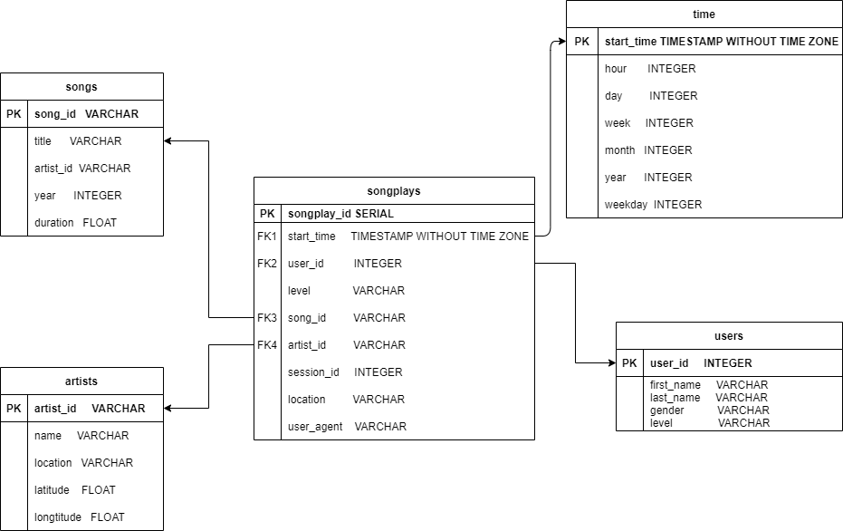

# Introduction:
***

A startup called Sparkify wants to analyze the data they've been collecting on songs and user activity on their new music streaming app. The analytics team is particularly interested in understanding what songs users are listening to. Currently, they don't have an easy way to query their data, which resides in a directory of JSON logs on user activity on the app, as well as a directory with JSON metadata on the songs in their app.

This project builds a Postgres database with tables and an ETL pipline using Python to optimize queries on song play analysis.

# Database Schema Design:
***

There are two main parts of Schema: Fact Table and Dimension Tables. Note: PK stands for primary key and FK stands for foreign key

Fact Table

1. songplays - records in log data associated with song play i.e. records with page NextSong
    - songplay_id (PK)
    - start_time (FK to time table)
    - user_id (FK to users table)
    - level
    - song_id (FK to songs table)
    - artist_id (FK to artists table)
    - session_id
    - location
    - user_agent

Dimension Tables

1. users - users in the app
    - user_id (PK)
    - first_name
    - last_name
    - gender
    - level
2. songs - songs in music database
    - song_id (PK)
    - title
    - artist_id (FK to artists)
    - year
    - duration
3. artists - artist in music database
    - artist_id (PK)
    - name
    - location
    - latitude
    - longitude
4. time - timestamps of records in songplays broken down into specific units
    - start_time (PK)
    - hour
    - day
    - week
    - month
    - year
    - weekday
    
Songplays table is at the center of the schema and all four of dimension tables are the brances from the songplays table.

# ETL Pipeline
***

1. songplays is from the source log data file. Then, only records with page NextSong will be stored in songplays table. To find song_id and artist_id, the duration, name of artist and title of song will be compared inside songs and artists tables.
2. users is from the source log data file to store all the information of users.
3. songs is from the source song data file.
4. artists is from the sourse of song data file.
5. time is from the source of log data file. From the timestamps of log data file, all the varibles will be determined.

# Files in Project
***

1. data folder contains all the log data and song data files.
2. create_tables.py drops and creates tables in the sparkify database. Run this file to reset tables before each time run your ETL Scripts.
3. etl.ipynb reads and processes a single file from song_data and log_data and loads the data into tables. This notebook contains detailed instructions on the ETL process for each of the tables.
4. etl.py reads and processes files from song_data and log_data and loads them into tables.
5. image contains the ER Diagram showing how the fact and dimension tables are connected. 
6. sql_queries.py contains all your sql queries, and is imported into the last three files above.
7. README.md provides dicussion on project.

# How to Run the Project
***

- Run create_tables.py first in where the project you downloaded.
- Then run etl.py to load all the data into the sparkify database.
- Test the database by run test.ipynb, which open by jupyter notbook.

# ER Diagram
***

